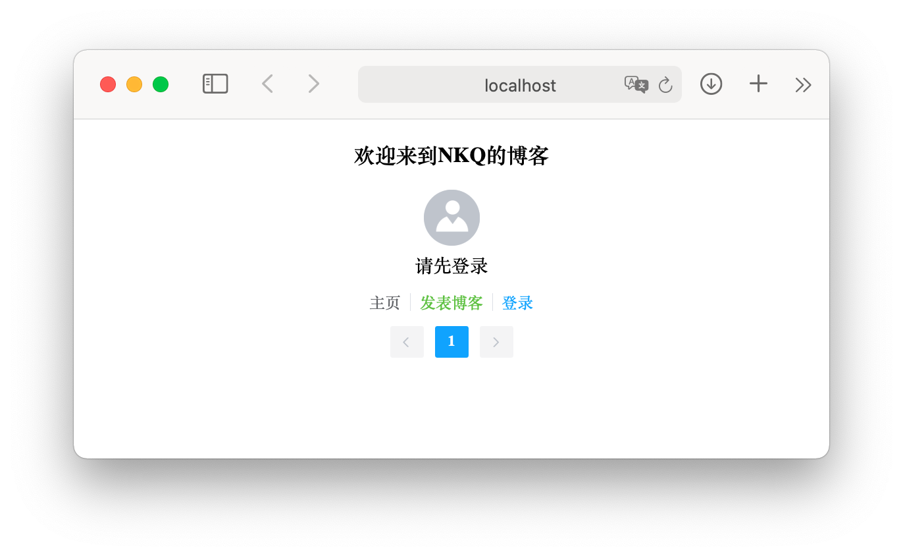

# Nblog

技术：

- 框架相关：Spring Boot、Mybatis、Shiro、Swagger、JWT、Lombok、PageHelper
- 前端：Vue、axios、Element、mavonEditor
- 数据库：MySQL、Redis

功能：

- 个人文章分页展示✅
- 支持MarkDown编辑、浏览✅
- 前后端分离开发✅
- Shiro + JWT 权限认证✅

TODO：

- 更美观的界面
- 搜索功能
